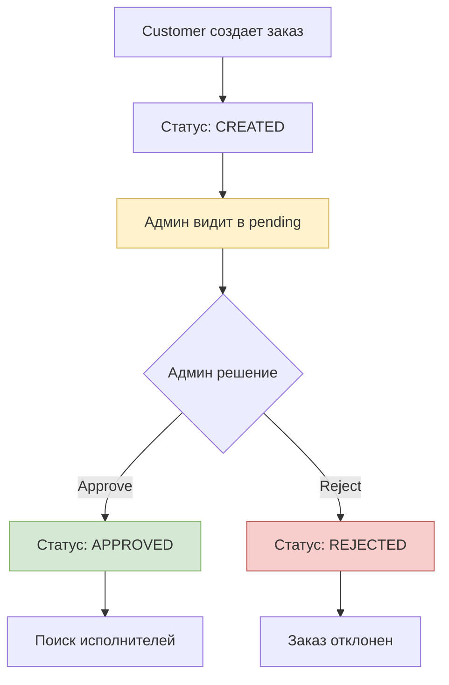

# Admin Modules - Админские модули

## 📁 Структура admin modules

```
admin-modules/
├── admin-orders.md       # Модерация заказов
├── admin-users.md        # Управление пользователями
├── admin-config.md       # Настройки системы
├── admin-vehicles.md     # Каталог транспорта
├── admin-broadcasts.md   # Массовые рассылки
├── admin-analytics.md    # Аналитика и отчеты
└── README.md            # Этот файл
```

## 🛡️ Общие принципы админки

### Доступ только для админов
Все админские endpoint'ы защищены `@Admin()` декоратором:
```typescript
@Controller('admin')
export class AdminOrdersController {
  @Get('orders/pending')
  @Admin()
  async getPendingOrders() {
    return this.adminOrdersService.getPendingOrders();
  }
}
```

### Логирование всех действий
Каждое админское действие логируется в таблицу `AdminAction`:
```typescript
await this.prisma.adminAction.create({
  data: {
    adminId: admin.id,
    action: AdminActionType.APPROVE_ORDER,
    entityType: 'ORDER',
    entityId: orderId.toString(),
    details: { comment: dto.comment },
  },
});
```

### Единый формат ответов
```typescript
return {
  success: true,
  data: result,
  message: 'Admin action completed',
  adminAction: {
    action: 'APPROVE_ORDER',
    timestamp: new Date().toISOString(),
  },
};
```

## 🎯 Админские модули

### Admin Orders (6 endpoints)
**Назначение**: Модерация всех заказов в системе
- `GET /admin/orders/pending` - Заказы на модерации
- `POST /admin/orders/:id/approve` - Одобрение заказа
- `POST /admin/orders/:id/reject` - Отклонение заказа
- `GET /admin/orders/moderated` - История модерации
- `GET /admin/orders/stats` - Статистика по заказам
- `POST /admin/orders/bulk-action` - Массовые операции

### Admin Users (6 endpoints)
**Назначение**: Управление пользователями системы
- `GET /admin/users` - Список пользователей с фильтрами
- `GET /admin/users/:id` - Детали пользователя
- `POST /admin/users/:id/block` - Блокировка пользователя
- `POST /admin/users/:id/unblock` - Разблокировка
- `PUT /admin/users/:id/balance` - Изменение баланса
- `GET /admin/users/stats` - Статистика пользователей

### Admin Config (4 endpoints)
**Назначение**: Управление настройками системы
- `GET /admin/config` - Все настройки
- `PUT /admin/config/:key` - Обновление настройки
- `GET /admin/config/history` - История изменений
- `POST /admin/config/reset` - Сброс к умолчанию

### Admin Vehicles (4 endpoints)
**Назначение**: CRUD каталога транспорта
- `POST /admin/vehicles/categories` - Создание категории
- `PUT /admin/vehicles/categories/:id` - Обновление
- `DELETE /admin/vehicles/categories/:id` - Удаление
- `GET /admin/vehicles/management` - Управление каталогом

### Admin Broadcasts (3 endpoints)
**Назначение**: Массовые рассылки пользователям
- `POST /admin/broadcasts` - Создание рассылки
- `GET /admin/broadcasts` - История рассылок
- `POST /admin/broadcasts/:id/send` - Отправка рассылки

### Admin Analytics (2 endpoints)
**Назначение**: Аналитика и отчеты
- `GET /admin/analytics/dashboard` - Основная аналитика
- `GET /admin/analytics/reports` - Детальные отчеты

## 🔐 Система безопасности

### AdminGuard
```typescript
@Injectable()
export class AdminGuard implements CanActivate {
  canActivate(context: ExecutionContext): boolean {
    const request = context.switchToHttp().getRequest();
    const user = request.user;
    
    return user?.roles?.some(role => role.role === RoleType.ADMIN) ?? false;
  }
}
```

### Admin Decorator
```typescript
export function Admin() {
  return applyDecorators(
    UseGuards(JwtAuthGuard, AdminGuard),
    ApiSecurity('bearer'),
  );
}
```

## 📊 Логирование действий

### AdminAction Entity
```typescript
enum AdminActionType {
  APPROVE_ORDER = 'APPROVE_ORDER',
  REJECT_ORDER = 'REJECT_ORDER',
  BLOCK_USER = 'BLOCK_USER',
  UNBLOCK_USER = 'UNBLOCK_USER',
  UPDATE_BALANCE = 'UPDATE_BALANCE',
  UPDATE_CONFIG = 'UPDATE_CONFIG',
  CREATE_BROADCAST = 'CREATE_BROADCAST',
  UPDATE_VEHICLE_CATEGORY = 'UPDATE_VEHICLE_CATEGORY',
  DELETE_VEHICLE_CATEGORY = 'DELETE_VEHICLE_CATEGORY',
}
```

### Автоматическое логирование
```typescript
private async logAdminAction(
  adminId: number,
  action: AdminActionType,
  entityType: string,
  entityId: string,
  details?: any,
) {
  await this.prisma.adminAction.create({
    data: {
      adminId,
      action,
      entityType,
      entityId,
      details: details ? JSON.stringify(details) : null,
    },
  });
}
```

## 🔄 Workflow модерации заказов



## 📈 Система настроек

### Типы настроек
```typescript
interface SystemConfigCategories {
  pricing: {
    order_price: { amount: number };
    tariff_rates: { [region: string]: { oneTime: number; optimal: number } };
  };
  links: {
    telegram_bot_link: { url: string };
    mini_app_link: { url: string };
  };
  limits: {
    max_orders_per_day: { count: number };
    referral_bonus: { amount: number };
  };
}
```

### Динамическое использование
```typescript
const orderPrice = await this.configService.get('order_price');
const price = orderPrice.value.amount; // 70
```

## 🚀 Массовые рассылки

### Типы рассылок
- `ALL_USERS` - Всем пользователям
- `CUSTOMERS_ONLY` - Только заказчикам
- `PERFORMERS_ONLY` - Только исполнителям
- `SPECIFIC_USERS` - Конкретным пользователям
- `BY_REGION` - По регионам

### Процесс рассылки
1. Админ создает рассылку (статус `DRAFT`)
2. Загружает изображение (опционально)
3. Выбирает целевую аудиторию
4. Отправляет рассылку (статус `SENDING`)
5. Система обрабатывает через очередь
6. Статус меняется на `SENT` или `FAILED`

## 📊 Аналитика

### Dashboard метрики
- Общее количество пользователей
- Активные заказы по статусам
- Финансовые показатели
- Статистика модерации
- Популярные регионы и типы транспорта

### Детальные отчеты
- Отчет по пользователям с фильтрами
- Отчет по заказам за период
- Финансовый отчет по платежам
- Отчет по модерации админов 