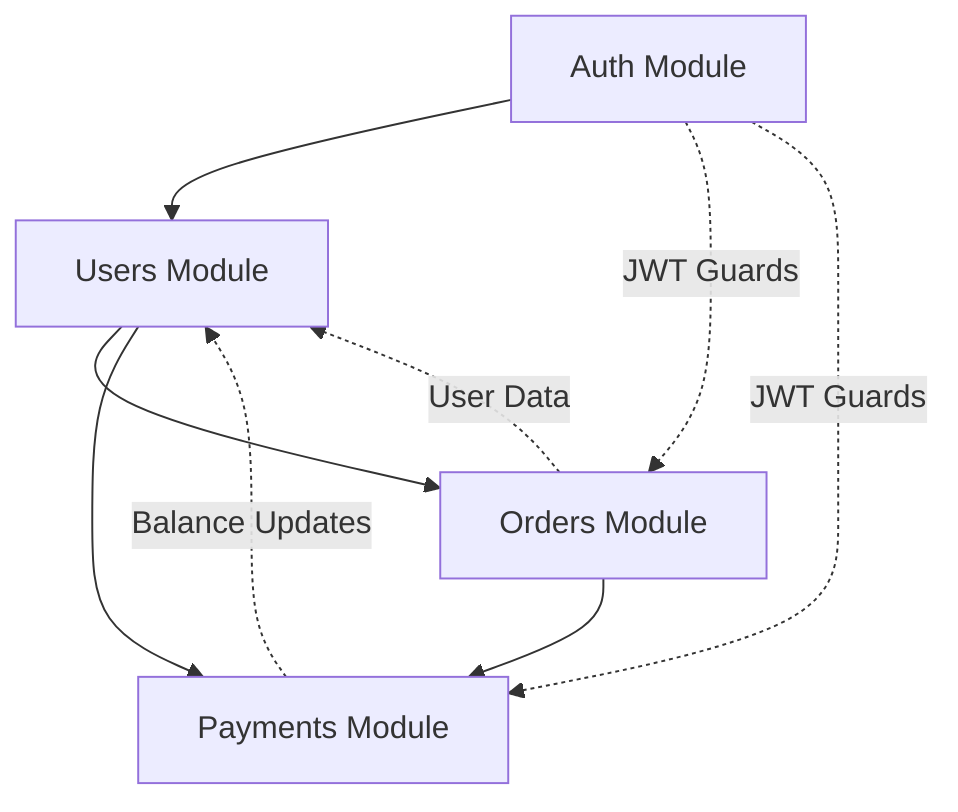

# Core Modules - Основные модули системы

## 📁 Структура core modules

```
core-modules/
├── users-module.md       # Users Module - управление пользователями
├── orders-module.md      # Orders Module - заказы и матчинг
├── payments-module.md    # Payments Module - Tinkoff интеграция
├── auth-module.md        # Auth Module - аутентификация
└── README.md            # Этот файл
```

## 🎯 Назначение модулей

### Users Module
- **Назначение**: Управление пользователями, ролями, балансами
- **Endpoints**: 8 endpoint'ов
- **Ключевые функции**:
  - CRUD пользователей
  - Система ролей (Customer, Performer, Admin)
  - Управление транспортом пользователей
  - Реферальная система
  - Балансы пользователей

### Orders Module
- **Назначение**: Создание заказов, поиск исполнителей, матчинг
- **Endpoints**: 8 endpoint'ов
- **Ключевые функции**:
  - Создание заказов (A→B, Place, People)
  - Система статусов с модерацией
  - Алгоритм поиска исполнителей
  - Отклики на заказы
  - Управление заказами

### Payments Module
- **Назначение**: Интеграция с Tinkoff, управление балансами
- **Endpoints**: 6 endpoint'ов
- **Ключевые функции**:
  - Создание платежей через Tinkoff API
  - Webhook обработка
  - Управление балансами
  - История платежей
  - Система тарифов

### Auth Module
- **Назначение**: Аутентификация пользователей
- **Endpoints**: 4 endpoint'а
- **Ключевые функции**:
  - JWT аутентификация
  - Telegram Bot аутентификация
  - Telegram Mini App аутентификация
  - Refresh токены
  - Guards и декораторы

## 🔗 Взаимодействие модулей



## 📋 Общие принципы

### Dependency Injection
Все модули используют NestJS DI для внедрения зависимостей:
```typescript
@Injectable()
export class UsersService {
  constructor(
    private prisma: PrismaService,
    private paymentsService: PaymentsService, // Инжекция другого сервиса
  ) {}
}
```

### Error Handling
Единая система обработки ошибок:
```typescript
throw new BadRequestException('Invalid user data');
throw new NotFoundException('User not found');
throw new UnauthorizedException('Access denied');
```

### Response Format
Единый формат ответов:
```typescript
return {
  success: true,
  data: result,
  message: 'Operation completed successfully',
  timestamp: new Date().toISOString(),
};
```

### Validation
Все входные данные валидируются через DTO:
```typescript
@Post()
async create(@Body() dto: CreateUserDto) {
  // DTO автоматически валидируется
  return this.usersService.create(dto);
}
```

## 🔧 Shared Services

### PrismaService
Единый сервис для работы с базой данных, используется всеми модулями.

### ConfigService
Управление конфигурацией приложения, доступен глобально.

### NotificationsService
Сервис уведомлений, используется Orders и Payments модулями.

## 📊 Метрики модулей

| Модуль | Endpoints | Сервисы | DTOs | Guards |
|--------|-----------|---------|------|--------|
| Auth | 4 | 1 | 3 | 3 |
| Users | 8 | 1 | 5 | 2 |
| Orders | 8 | 2 | 4 | 2 |
| Payments | 6 | 2 | 3 | 1 |

## 🚀 Порядок разработки

1. **Auth Module** - базовая аутентификация
2. **Users Module** - управление пользователями
3. **Orders Module** - основная бизнес-логика
4. **Payments Module** - интеграция платежей

Каждый модуль должен быть полностью протестирован перед переходом к следующему. 