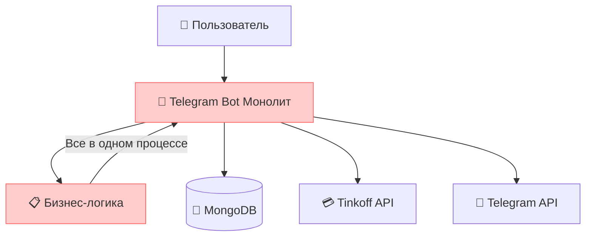
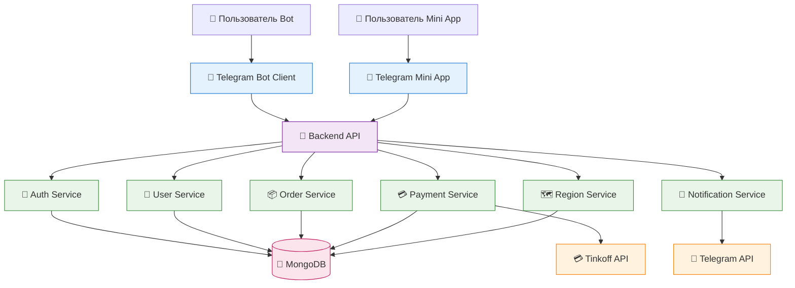

# Архитектурное разделение Telega Logistics

## Текущее состояние vs Целевая архитектура

### СЕЙЧАС: Монолит


### ЦЕЛЬ: Микросервисная архитектура


## Анализ разделения компонентов

### 1. ЧТО ПЕРЕНОСИМ В BACKEND API

#### Core Business Logic
```yaml
User Management:
  - Регистрация пользователей (Customer/Performer)
  - Управление профилями и балансами
  - Реферальная система
  - Система рейтингов

Order Management:
  - CRUD операции с заказами
  - Lifecycle заказов (create → search → in_work → finish)
  - Matching заказов и исполнителей
  - Ценообразование по регионам

Payment System:
  - Интеграция с Tinkoff
  - Управление балансами
  - История платежей
  - Тарифные планы

Geographic System:
  - Управление регионами
  - Привязка пользователей к регионам
  - Поиск по географии

Notification System:
  - Отправка уведомлений
  - Управление очередями сообщений
  - Templates для сообщений
```

#### Data Layer
```yaml
Database Operations:
  - Все CRUD операции
  - Валидация данных
  - Транзакции
  - Индексы и оптимизация

Business Rules:
  - Лимиты пользователей
  - Проверка балансов
  - Валидация заказов
  - Rate limiting логика
```

### 2. ЧТО ОСТАЕТСЯ В КЛИЕНТАХ

#### Telegram Bot
```yaml
UI Layer:
  - Обработка команд и callback'ов
  - Клавиатуры и интерфейс
  - FSM состояния диалогов
  - Форматирование сообщений

Client Logic:
  - Валидация ввода пользователя
  - Навигация по меню
  - Локальное кэширование состояний
```

#### Telegram Mini App
```yaml
Web Interface:
  - HTML/CSS/JavaScript интерфейс
  - Формы и компоненты
  - Клиентская валидация
  - Responsive дизайн
```

## Проектирование API Endpoints

### Authentication & Users
```yaml
POST /api/auth/register
  - Регистрация нового пользователя
  - Body: { user_id, username, role, name, phone, ref_code? }

GET /api/users/{user_id}
  - Получение профиля пользователя

PUT /api/users/{user_id}
  - Обновление профиля

GET /api/users/{user_id}/balance
  - Получение баланса

POST /api/users/{user_id}/balance/topup
  - Пополнение баланса
```

### Orders
```yaml
POST /api/orders
  - Создание заказа
  - Body: { type, car_details, location, requirements, ... }

GET /api/orders
  - Список заказов (с фильтрами)
  - Query: { status?, region?, user_id?, type? }

GET /api/orders/{order_id}
  - Детали заказа

PUT /api/orders/{order_id}/status
  - Обновление статуса заказа

POST /api/orders/{order_id}/take
  - Взятие заказа исполнителем

GET /api/orders/available
  - Доступные заказы для исполнителя
  - Query: { user_id, regions[] }
```

### Payments
```yaml
POST /api/payments/init
  - Инициация платежа
  - Body: { user_id, amount, type }

POST /api/payments/webhook
  - Webhook от Tinkoff

GET /api/payments/{user_id}/history
  - История платежей
```

### Regions & Geography
```yaml
GET /api/regions
  - Список всех регионов

GET /api/regions/{region_id}/subregions
  - Подрегионы

PUT /api/users/{user_id}/regions
  - Обновление активных регионов пользователя
```

### Notifications
```yaml
POST /api/notifications/send
  - Отправка уведомления
  - Body: { user_id, type, message, data }

GET /api/notifications/templates
  - Шаблоны уведомлений
```

## Выявленные улучшения архитектуры

### 1. 🔧 Оптимизация структуры данных

#### Проблема в текущем коде:
```python
# Сейчас: Дублирование пользователей в разных коллекциях
user_db.users        # общие данные
custumer_db.custumer # заказчики  
performer_db.performer # исполнители
```

#### Улучшение:
```yaml
Unified User Model:
  - Одна коллекция users с полями role[]
  - Избавляемся от дублирования
  - Упрощаем переключение между ролями
```

### 2. 🚀 Улучшение системы состояний

#### Проблема:
```python
# FSM состояния жестко привязаны к Telegram Bot
class Register_user(StatesGroup):
    Name = State()
    Phone = State()
```

#### Улучшение:
```yaml
Stateless API:
  - Состояния храним в базе данных
  - API не зависит от конкретного клиента
  - Возможность продолжить диалог в другом клиенте
```

### 3. 📊 Улучшение системы уведомлений

#### Проблема:
```python
# Очереди сообщений в памяти бота
priority_queue = asyncio.Queue()
broadcast_queue = asyncio.Queue()
```

#### Улучшение:
```yaml
Message Queue Service:
  - Персистентные очереди (Redis/RabbitMQ)
  - Retry механизм
  - Dead letter queues
  - Масштабируемость
```

### 4. 🔐 Улучшение безопасности

#### Добавляем:
```yaml
Security Enhancements:
  - JWT токены для API
  - Rate limiting на API уровне
  - Input validation с схемами
  - Audit logging
  - CORS для Mini App
```

### 5. 📈 Улучшение производительности

#### Оптимизации:
```yaml
Performance:
  - Кэширование (Redis)
  - Database индексы
  - Пагинация для больших списков
  - Lazy loading
  - Connection pooling
```

## Миграционная стратегия

### Этап 1: Подготовка
```yaml
Phase 1:
  - Проектирование API схемы
  - Настройка инфраструктуры
  - Создание базовых endpoints
  - Тестирование интеграций
```

### Этап 2: Постепенная миграция
```yaml
Phase 2:
  - Выносим User Management
  - Выносим Order Management  
  - Выносим Payment System
  - Параллельно работают обе системы
```

### Этап 3: Переключение клиентов
```yaml
Phase 3:
  - Адаптируем Telegram Bot к API
  - Создаем Mini App
  - Тестируем совместимость
  - Постепенное переключение пользователей
```

### Этап 4: Оптимизация
```yaml
Phase 4:
  - Отключаем старый монолит
  - Оптимизируем производительность
  - Добавляем мониторинг
  - Улучшаем UX
```

## Ключевые преимущества новой архитектуры

### 🎯 Гибкость
- Независимая разработка клиентов
- Возможность добавления новых клиентов (Web App, Mobile App)
- A/B тестирование интерфейсов

### 📈 Масштабируемость  
- Горизонтальное масштабирование API
- Независимое масштабирование сервисов
- Кэширование и оптимизация

### 🛠️ Maintainability
- Четкое разделение ответственности
- Упрощенное тестирование
- Независимые релизы

### 🔒 Безопасность
- Централизованная аутентификация
- Контроль доступа на API уровне
- Audit trail

## Технические детали для реализации

### Backend API Requirements
```yaml
Core Features:
  - RESTful API design
  - Async/await support
  - Database ORM/ODM
  - JWT authentication
  - Input validation
  - Error handling
  - Logging
  - Health checks

Integrations:
  - MongoDB driver
  - Tinkoff API client
  - Telegram API client
  - Message queue (Redis/RabbitMQ)
  - Caching (Redis)

Infrastructure:
  - Docker containers
  - Environment configuration
  - CI/CD pipeline
  - Monitoring & alerting
```

### Client Requirements
```yaml
Telegram Bot:
  - HTTP client for API calls
  - JWT token management
  - Error handling
  - Retry logic
  - Offline capability

Mini App:
  - React/Vue/Angular framework
  - API integration
  - Telegram WebApp SDK
  - Responsive design
  - State management
``` 