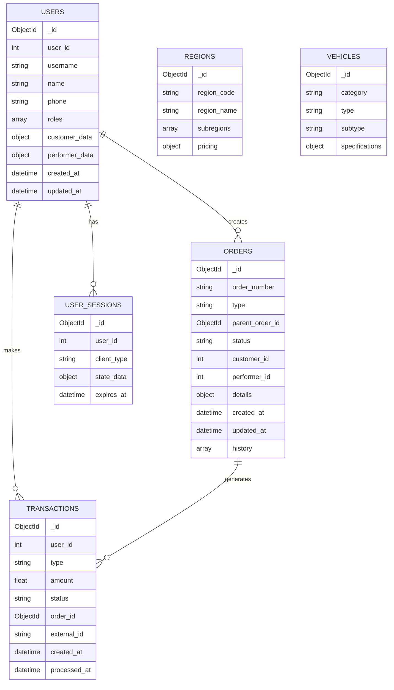

# Анализ миграции данных и улучшения структуры

## Проблемы текущей структуры данных

### 1. 🔄 Дублирование пользователей

#### Текущая проблема:
```python
# 3 разные коллекции для одного пользователя
user_db.users = {
    "user_id": 123,
    "register": False,
    "performer": True,
    "custumer": False
}

performer_db.performer = {
    "user_id": 123,
    "username": "user123",
    "name": "Иван",
    "phone": "+79123456789",
    "balance": 1000,
    # ... много других полей
}

custumer_db.custumer = {
    "user_id": 123,  # Дублирование!
    "username": "user123",  # Дублирование!
    "name": "Иван",  # Дублирование!
    "phone": "+79123456789",  # Дублирование!
    # ... аналогичные поля
}
```

#### 🎯 Улучшенная структура:
```yaml
users: # Единая коллекция
  _id: ObjectId
  user_id: 123
  username: "user123"
  name: "Иван"
  phone: "+79123456789"
  
  # Объединенные роли
  roles: ["customer", "performer"]
  
  # Customer-specific поля
  customer_data:
    balance: 500
    orders: []
    main_limit: 2
    setting_limit: 2
    
  # Performer-specific поля  
  performer_data:
    balance: 1000
    cars: {}
    all_regions: {}
    tariff: true
    
  # Общие поля
  date_registered: ISODate
  rating: 5
  ref_code: "ABC123"
  referrals: []
  logs: []
```

### 2. 📊 Неэффективные запросы

#### Текущая проблема:
```python
# Сейчас: 3 запроса для получения полной информации о пользователе
user = await user_db.find_user(user_id)
if user["performer"]:
    performer = await performer_db.find_performer(user_id)
if user["custumer"]:  
    customer = await custumer_db.find_custumer(user_id)
```

#### 🎯 Улучшение:
```yaml
# Один запрос для полной информации
GET /api/users/{user_id}
# Возвращает весь профиль с обеими ролями
```

### 3. 🔍 Сложность поиска заказов

#### Текущая проблема:
```python
# Поиск заказов разбросан по коллекциям
orders = await order_db.find({})
suborders = await subid_db.find({})
# Нужно объединять и фильтровать
```

#### 🎯 Улучшение:
```yaml
orders: # Единая коллекция с типизацией
  _id: ObjectId
  order_number: "ORD-2024-001"
  type: "order" | "suborder"
  parent_order_id: ObjectId? # только для suborder
  
  # Унифицированная структура
  status: "create" | "search" | "in_work" | "finished" | "canceled"
  customer_id: 123
  performer_id: 456?
  
  # Детали заказа
  order_type: "a_b" | "place" | "people"
  vehicle_requirements: {}
  location: {}
  pricing: {}
  
  # Временные метки
  created_at: ISODate
  updated_at: ISODate
  
  # Аудит
  history: []
```

### 4. 💳 Хаотичная система платежей

#### Текущая проблема:
```python
# Платежи в разных коллекциях
payments_db.payments  # основные платежи
paymentinfo_db.payment # информация о платежах
# Связи неочевидны
```

#### 🎯 Улучшение:
```yaml
transactions: # Унифицированная система
  _id: ObjectId
  user_id: 123
  type: "topup" | "order_payment" | "refund" | "referral_bonus"
  
  # Финансовые данные
  amount: 100.50
  currency: "RUB"
  status: "pending" | "completed" | "failed" | "refunded"
  
  # Связанные объекты
  order_id: ObjectId?
  external_payment_id: "tinkoff_uuid"
  
  # Временные метки
  created_at: ISODate
  processed_at: ISODate?
  
  # Метаданные
  payment_method: "tinkoff"
  description: "Пополнение баланса"
  metadata: {}
```

## Новая архитектура данных

### 🏗️ Унифицированная модель



### 📊 Оптимизированные индексы

```javascript
// Пользователи
db.users.createIndex({ "user_id": 1 }, { unique: true })
db.users.createIndex({ "username": 1 })
db.users.createIndex({ "roles": 1 })
db.users.createIndex({ "phone": 1 })

// Заказы
db.orders.createIndex({ "order_number": 1 }, { unique: true })
db.orders.createIndex({ "status": 1, "created_at": -1 })
db.orders.createIndex({ "customer_id": 1, "status": 1 })
db.orders.createIndex({ "performer_id": 1, "status": 1 })
db.orders.createIndex({ "details.location.region": 1, "status": 1 })

// Транзакции
db.transactions.createIndex({ "user_id": 1, "created_at": -1 })
db.transactions.createIndex({ "status": 1, "created_at": -1 })
db.transactions.createIndex({ "external_id": 1 }, { unique: true, sparse: true })

// Сессии
db.user_sessions.createIndex({ "user_id": 1, "client_type": 1 })
db.user_sessions.createIndex({ "expires_at": 1 }, { expireAfterSeconds: 0 })
```

## Миграционный скрипт (концептуальный)

### 1. Миграция пользователей
```python
async def migrate_users():
    # Получаем всех пользователей из старых коллекций
    old_users = await old_user_db.find({}).to_list(None)
    
    for old_user in old_users:
        new_user = {
            "user_id": old_user["user_id"],
            "username": old_user.get("username"),
            "roles": [],
            "created_at": old_user.get("register_date", datetime.now()),
            "updated_at": datetime.now()
        }
        
        # Добавляем роль customer
        if old_user.get("custumer"):
            customer_data = await old_custumer_db.find_one({"user_id": old_user["user_id"]})
            new_user["roles"].append("customer")
            new_user["customer_data"] = extract_customer_fields(customer_data)
            new_user["name"] = customer_data.get("name")
            new_user["phone"] = customer_data.get("phone")
        
        # Добавляем роль performer  
        if old_user.get("performer"):
            performer_data = await old_performer_db.find_one({"user_id": old_user["user_id"]})
            new_user["roles"].append("performer")
            new_user["performer_data"] = extract_performer_fields(performer_data)
            if not new_user.get("name"):
                new_user["name"] = performer_data.get("name")
            if not new_user.get("phone"):
                new_user["phone"] = performer_data.get("phone")
        
        await new_users_collection.insert_one(new_user)
```

### 2. Миграция заказов
```python
async def migrate_orders():
    # Основные заказы
    old_orders = await old_order_db.find({}).to_list(None)
    for old_order in old_orders:
        new_order = {
            "order_number": old_order.get("order_number"),
            "type": "order",
            "status": old_order.get("status"),
            "customer_id": old_order.get("customer", {}).get("user_id"),
            "performer_id": extract_performer_id(old_order.get("performer")),
            "order_type": old_order.get("type_order"),
            "details": extract_order_details(old_order),
            "created_at": old_order.get("create_date", datetime.now()),
            "updated_at": datetime.now(),
            "history": old_order.get("log", [])
        }
        await new_orders_collection.insert_one(new_order)
    
    # Подзаказы
    old_suborders = await old_subid_db.find({}).to_list(None)
    for old_suborder in old_suborders:
        new_suborder = {
            "type": "suborder",
            "parent_order_id": old_suborder.get("parent_id"),
            "status": old_suborder.get("status"),
            "performer_id": extract_performer_id(old_suborder.get("performer")),
            "created_at": old_suborder.get("create_date", datetime.now()),
            "updated_at": datetime.now()
        }
        await new_orders_collection.insert_one(new_suborder)
```

### 3. Миграция платежей
```python
async def migrate_transactions():
    old_payments = await old_payments_db.find({}).to_list(None)
    
    for old_payment in old_payments:
        new_transaction = {
            "user_id": old_payment.get("user_id"),
            "type": "topup",  # определяем тип по контексту
            "amount": old_payment.get("amount"),
            "status": map_payment_status(old_payment.get("status")),
            "external_id": old_payment.get("order_id"),
            "payment_method": "tinkoff",
            "created_at": old_payment.get("create_date", datetime.now()),
            "processed_at": old_payment.get("update_date"),
            "description": "Пополнение баланса"
        }
        await new_transactions_collection.insert_one(new_transaction)
```

## Улучшения API дизайна

### 1. Консистентность ответов
```yaml
# Единый формат ответов
Success Response:
  success: true
  data: {}
  meta:
    timestamp: "2024-01-01T00:00:00Z"
    version: "1.0"

Error Response:
  success: false
  error:
    code: "VALIDATION_ERROR"
    message: "Validation failed"
    details: {}
  meta:
    timestamp: "2024-01-01T00:00:00Z"
    request_id: "uuid"
```

### 2. Пагинация
```yaml
# Стандартная пагинация
GET /api/orders?page=1&limit=20&sort=created_at&order=desc

Response:
  success: true
  data: []
  pagination:
    page: 1
    limit: 20
    total: 150
    total_pages: 8
    has_next: true
    has_prev: false
```

### 3. Фильтрация и поиск
```yaml
# Расширенные фильтры
GET /api/orders?status=search&region=77&order_type=a_b&created_after=2024-01-01

# Полнотекстовый поиск
GET /api/orders/search?q=перевозка&region=77
```

## Критические моменты миграции

### 🚨 Что нужно учесть:

1. **Целостность данных**
   - Проверка связей между коллекциями
   - Валидация всех полей
   - Резервное копирование

2. **Downtime минимизация**
   - Постепенная миграция по частям
   - Двойная запись во время перехода
   - Rollback план

3. **Производительность**
   - Миграция во время низкой нагрузки
   - Мониторинг ресурсов сервера
   - Оптимизация запросов

4. **Тестирование**
   - Миграция на staging окружении
   - Функциональное тестирование
   - Нагрузочное тестирование

5. **Обратная совместимость**
   - Поддержка старых клиентов во время миграции
   - Постепенное отключение старых endpoint'ов
   - Уведомления пользователей 