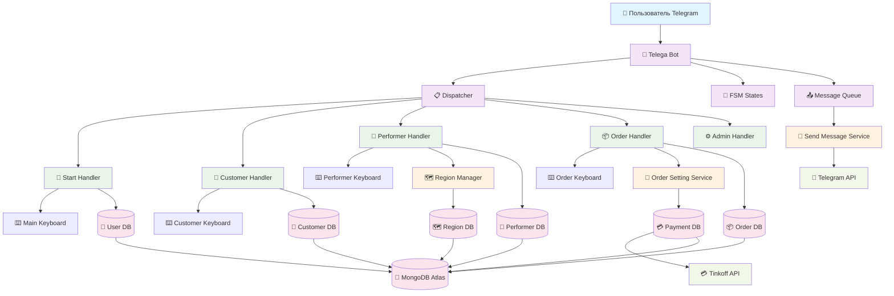
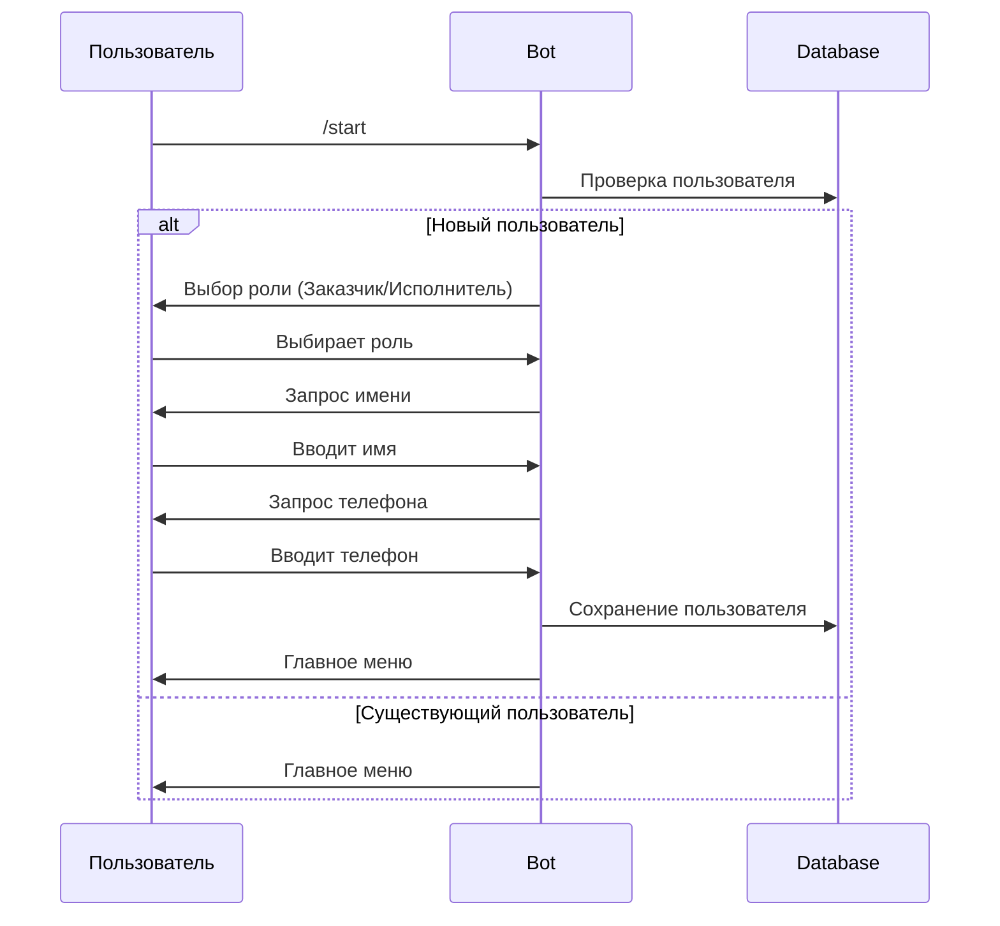
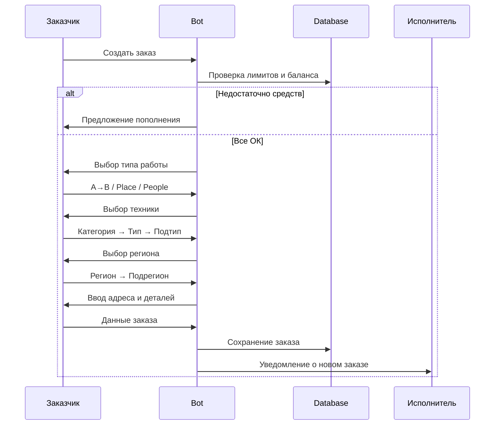
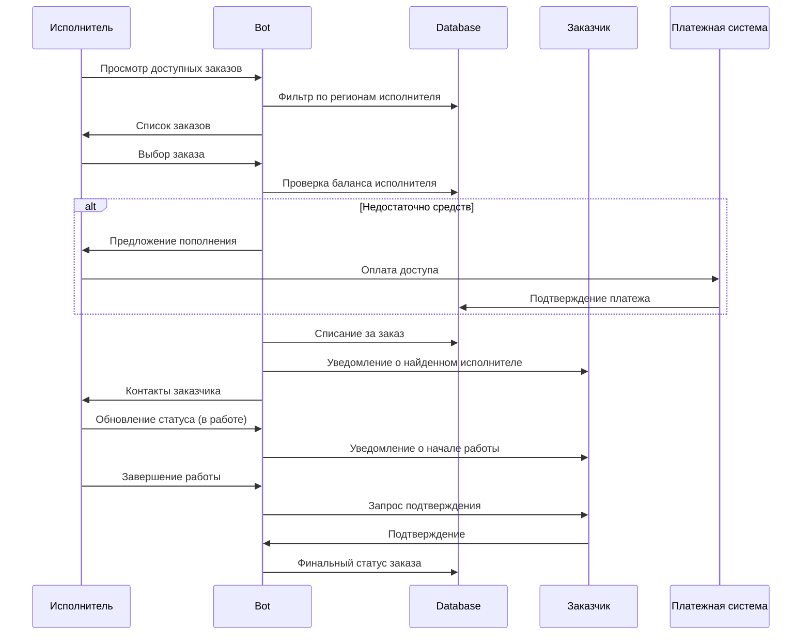
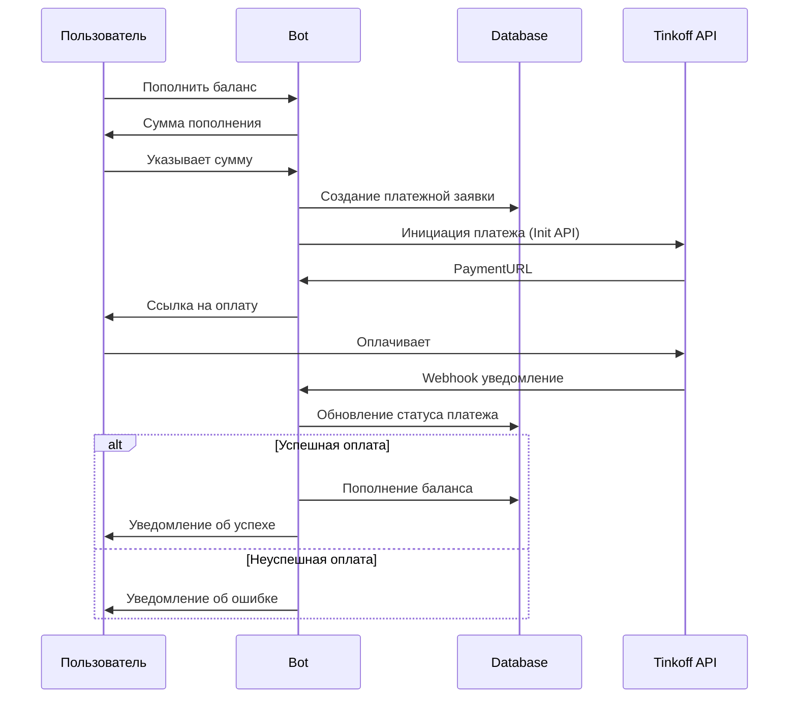
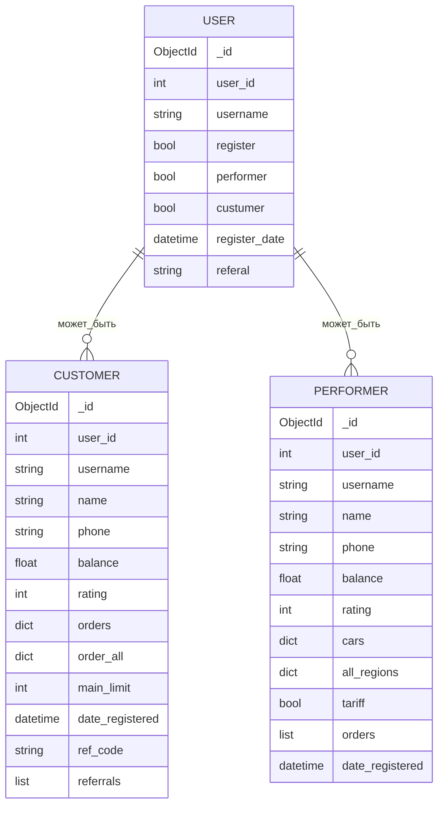
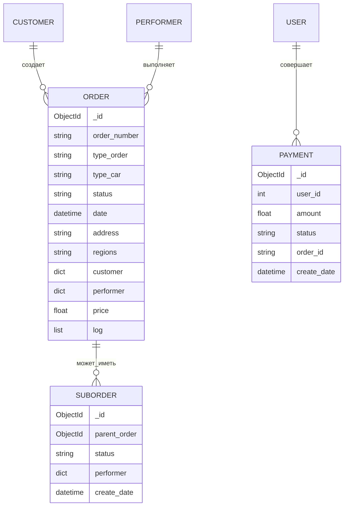

# Архитектура системы Telega Logistics Bot

## Диаграмма компонентов

## Бизнес-процессы

### 1. Регистрация пользователя

### 2. Создание заказа (Заказчик)

### 3. Выполнение заказа (Исполнитель)

### 4. Платежный процесс

## Схема данных

### Пользователи

### Заказы

## Ключевые особенности архитектуры

### 1. Асинхронность
- **asyncio** основа всей системы
- **Motor** для неблокирующих операций с MongoDB
- **Queue** система для обработки сообщений
- **Semaphore** для rate limiting

### 2. FSM (Finite State Machine)
- Управление диалогами через состояния
- **aiogram** FSM с MemoryStorage
- Группы состояний для разных процессов

### 3. Модульность
- Разделение по функциональности
- Отдельные handlers для каждой роли
- Сервисный слой для бизнес-логики

### 4. Масштабируемость
- Очереди сообщений для обработки нагрузки
- MongoDB для горизонтального масштабирования
- Webhook архитектура для интеграций

### 5. Безопасность
- SHA256 подписи для платежей  
- Валидация входных данных
- Rate limiting защита 